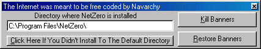



## NetZero v3\.1\.2

### Description

This is probably the first NetZero alteration made for v3.1.2 considering they only came out with it yesterday morning. It basically removes the NetZero banners, but also replaces the logon screen. I put a lot of work into the code and would appreciate votes and/or comments. I really don't want there to be arguments in the feedback section over how this effects NetZero, so for anybody who is going to post a reply please just let the comments be about the code.

*Now with disconnect button

*It now takes away the 40 hour time limmit!
 
### More Info
 
Just run the program it is pretty self-explanitory

It is all up in what the code does

             |
---                |---
**Submitted On**   |2001-02-06 18:40:22
**By**             |[Nave Zeng](https://github.com/Planet-Source-Code/PSCIndex/blob/master/ByAuthor/nave-zeng.md)
**Level**          |Intermediate
**User Rating**    |4.3 (86 globes from 20 users)
**Compatibility**  |VB 5\.0, VB 6\.0
**Category**       |[Miscellaneous](https://github.com/Planet-Source-Code/PSCIndex/blob/master/ByCategory/miscellaneous__1-1.md)
**World**          |[Visual Basic](https://github.com/Planet-Source-Code/PSCIndex/blob/master/ByWorld/visual-basic.md)
**Archive File**   |[CODE\_UPLOAD14610262001\.zip](https://github.com/Planet-Source-Code/nave-zeng-netzero-v3-1-2__1-14941/archive/master.zip)

### API Declarations

look in the zip

